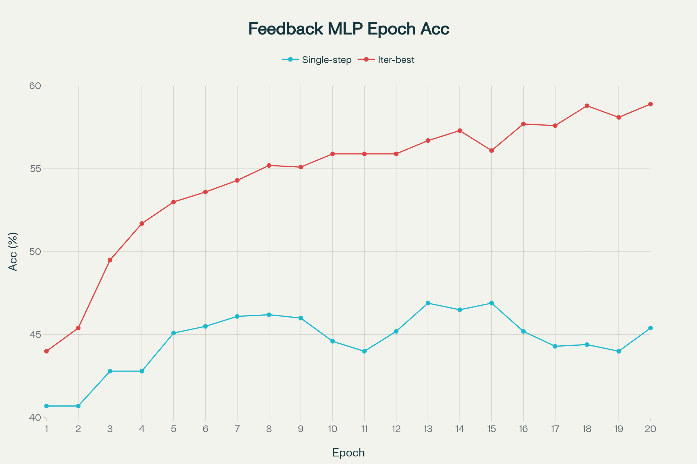

# Gated Feedback MLP

This project explores a simple but effective idea:  
**introducing a gated feedback mechanism into MLPs (Multi-Layer Perceptrons)** to enable iterative refinement of inputs.  

The goal isn’t to push state-of-the-art results, but to show that feedback in MLPs can mimic some CNN-like improvements in performance.

---

## ✨ Features
- 🔹 Basic MLP architecture with configurable number of layers  
- 🔹 **Gated feedback mechanism** for iterative refinement of inputs  
- 🔹 Implemented in **PyTorch** with modular, readable code  
- 🔹 Experiments on multiple datasets:
  - CIFAR-10 (image classification)
  - MNIST (handwritten digit recognition)
  - Two Moons (synthetic 2D toy dataset)  
- 🔹 Uses **ReLU**, **Leaky ReLU** activation for improved stability and training convergence
-  Unrolled Training: During training, the network is unrolled for a small number of feedback steps (default 5), and backpropagation is performed through this unrolled graph. This allows the model to learn from multiple feedback refinements during training, while still keeping training cost manageable. At test time, the model can be iterated for many more steps (e.g., up to 50) without additional training, but the typical peak improvement is seen within the trained iterations so far.

---

## 📊 Results Summary

| Dataset    | Single-Pass Accuracy (approx.) | Iterative Best Accuracy (approx.) |
|------------|--------------------------------|-----------------------------------|
| CIFAR-10   | ~46% (2-layer MLP)             | ~56% (after 4 iterations)         |
| MNIST      | Small improvements             | Single pass + 2%                  |
| Two Moons  | Clearer class separation       | Sharper decision boundaries       |

- Accuracy **increases with iterative inference** compared to single-pass.  
- **Leaky ReLU** activations improved training convergence and slightly boosted accuracy.  
- Best improvements observed on **CIFAR-10** (~10% relative gain).
- 

---

## ⚙️ How It Works
1. Input passes through the MLP.  
2. Output hidden state is transformed and gated.  
3. Feedback is added back to the input for the next iteration.  
4. Process repeats for several iterations.  
5. Final output is chosen from the last or best iteration.  

This simple feedback loop allows the model to refine its internal representation step by step.  


---
🔧 Tested Variations

Feedback strength (scaling factor):
Scaling the feedback (e.g., 0.5x, 0.8x) improved stability.
Too strong feedback caused worse training, possibly due to oscillations or divergence.

Number of feedback iterations:
Accuracy increased steadily up to ~4 iterations.
Accuracy reduces after ~5 iterations, so best iteration out of 10 is taken as final (usually 3rd or 4th).

---
## 🚀 Getting Started

Clone the repository and install dependencies:

```bash
git clone https://github.com/your-username/gated-feedback-mlp.git](https://github.com/Markiv9999/Gated-Feedback-MLP-Iterative-Refinement-on-CIFAR-10/
cd gated-feedback-mlp
pip install torch torchvision numpy matplotlib
Windows needs additional dependencies (this version was validated on windows cause my linux system is not with me right now)

```
---
## Results
CIFAR 10 (Best iter accuracy happens around 4th iteration every inference)

| Epoch | Single-Step Accuracy (%) | Iterative Best Accuracy (%) |
|-------|-------------------------|----------------------------|
| 1     | 40.7                    | 44.0                       |
| 2     | 40.7                    | 45.4                       |
| 3     | 42.8                    | 49.5                       |
| 4     | 42.8                    | 51.7                       |
| 5     | 45.1                    | 53.0                       |
| 6     | 45.5                    | 53.6                       |
| 7     | 46.1                    | 54.3                       |
| 8     | 46.2                    | 55.2                       |
| 9     | 46.0                    | 55.1                       |
| 10    | 44.6                    | 55.9                       |
| 11    | 44.0                    | 55.9                       |
| 12    | 45.2                    | 55.9                       |
| 13    | 46.9                    | 56.7                       |
| 14    | 46.5                    | 57.3                       |
| 15    | 46.9                    | 56.1                       |
| 16    | 45.2                    | 57.7                       |
| 17    | 44.3                    | 57.6                       |
| 18    | 44.4                    | 58.8                       |
| 19    | 44.0                    | 58.1                       |
| 20    | 45.4                    | 58.9                       |



